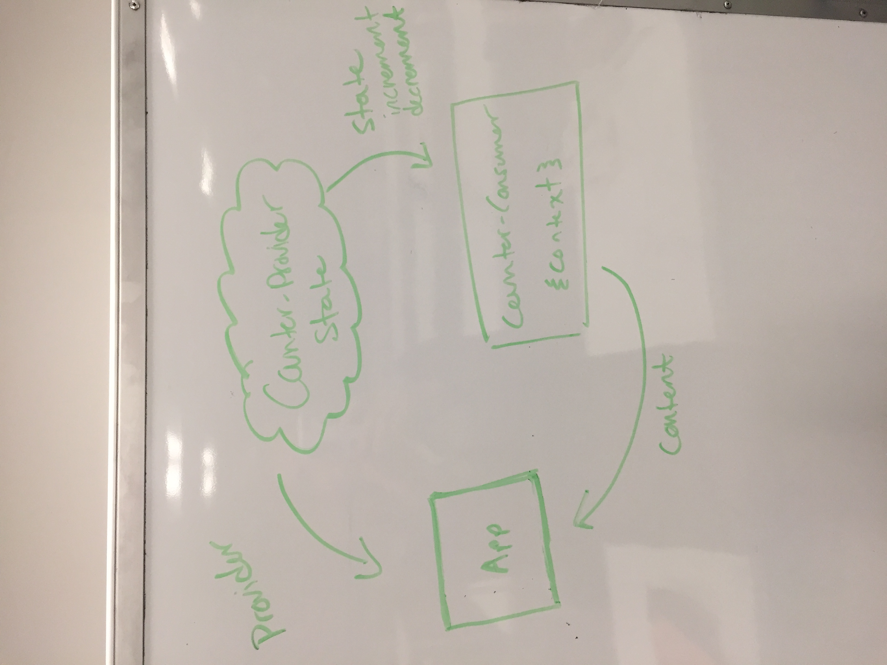

## Project Name: Context and Hooks Counters

### Author: Hannah Ingham

### Links and Resources
* [repo](https://github.com/hingham/36-context-and-hooks-hi)
* [travis](http://xyz.com)
* [back-end](http://xyz.com) (when applicable)

#### Documentation
* [jsdoc] `./context-and-hooks/docs/index.html`

### Modules
#### `content.js`
##### Exports content for title

#### `context.js`
##### Exports context for title

#### `count-consumer.js`
##### Exports content for the counter

#### `count-provider.js`
##### Exports state with incrementCount function and decrementCount function for the counter

### Setup
#### `.env` requirements
* `npm init react-app your-app-name`
* `npm i ` all other dependencies is package.json

#### Running the app
* `npm start`
* Endpoint: `/`
  * Returns the page with the title and the counter

  
#### Tests
* npm test

#### UML

